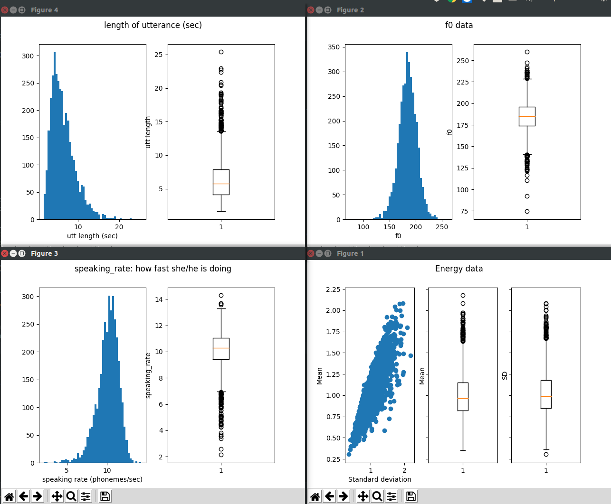

## pyEval
Extract (and evaluate :D) some statistics properties of a speaker, given some of their audio and corresponding text

## Usage

### Install
`pip install git+https://github.com/enamoria/speaker_evaluation_tts`

### API

    calculate(speaker, input_path, output_path="features", dictionary_path="vn.dict", frame_length=25, hop_length=10, recalculate=False)

Extracting features. Features will be stored as a list of dictionary, each of them is for each audio file:  

    features = pyEval.calculate("doanngocle_1", input_path="/data/data/tts/")
    
    
* 'energy': mean and sd energy of wav
* 'f0'    : mean voiced f0 of wav
* 'speaking_rates' : speaking rate (phonemes/sec) of wav
* 'utt_length'     : utterance length (sec) of wav
    

Plot results (scatter, histogram and boxplot)

    import pyEval
    pyEval.draw_plot(speaking_rate_data=features['speaking_rates'])`
    pyEval.draw_plot(energy_data=features['energy'])`
    pyEval.draw_plot(energy_data=features['energy'], f0_data=features['f0'], speaking_rate_data=features['speaking_rates'], utt_length=features['utt_length'])`

Results:

